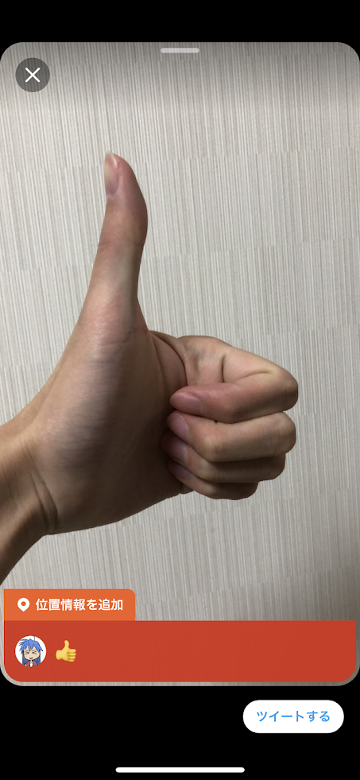
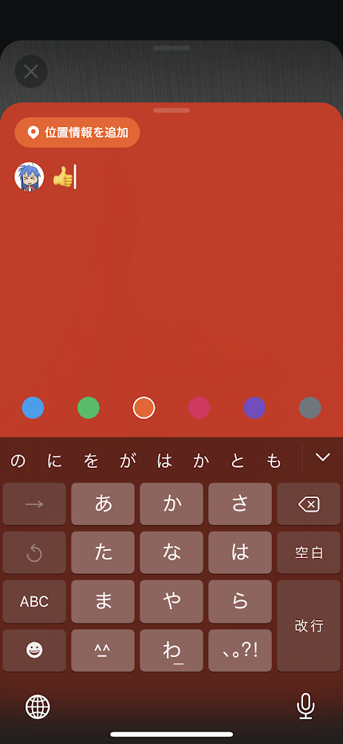

  <h1>モチベーション - Twitterに新しい解析対象</h1>
  

    <ul style={{
      fontSize: 38,
      marginTop: 40,
      width: 1000
    }} className="list-with-nice-margin centered" >
      <li>
        2016年冬頃から、TwitterのIn-Appカメラで撮影した画像のツイート方式が変更
      </li>
    </ul>
    

      
      
    

  

